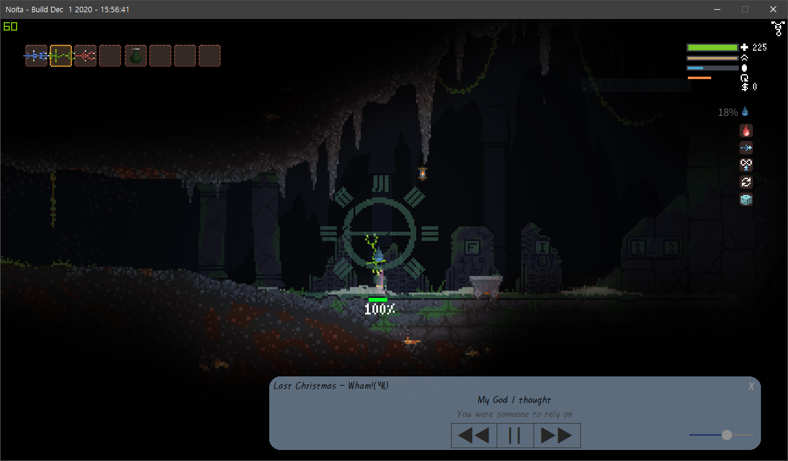

Read Me
=======

## 1. 사용법 How to Use
[Chrome](https://www.google.com/intl/en/chrome/)을 설치합니다. *이미 설치되어 있으면 무시*   
Install [Chrome](https://www.google.com/intl/en/chrome/). *Ignore if already installed*

[Bugs](https://music.bugs.co.kr/)에서 로그인을 하고   
**ForViewer**라는 이름의 앨범을 생성합니다.   
이 앨범에 원하는 곡을 추가합니다.   
Log in to [Bugs](https://music.bugs.co.kr/) and create an album named **ForViewer**.  
Add the desired song to the album.  
   
프로그램을 실행시켜 **ForViewer**앨범이 있는 아이디로 로그인합니다.   
프로그램의 로딩이 끝나면 앨범 내의 곡들을 랜덤한 순서대로 재생합니다.   
Run the program and log in with the ID with the **ForViewer** album.   
After the program finishes loading, It'll plays the songs in the album in random order.

## 2. 기능 Function
윈도우 창이 항상 맨 앞으로 고정되어 있어 다른 프로그램 사용중에도, 지속적으로 사용할 수 있습니다.   
The window is always pinned to the front so that it can be used continuously, even during other programs.
   
우측 하단의 슬라이더로 투명도를 조절할 수 있습니다.   
The transparency can be adjusted with the slider at the bottom right.
   
재생, 일시정지, 이전곡, 다음곡 제어를 버튼으로 할 수 있습니다.   
You can control playback, pause, previous song, and next song.

아이디 및 패스워드를 한번 입력하면 저장되고   
이후 프로그램 실행 시 로그인 버튼만 누르면 바로 접속할 수 있습니다.   
Once you enter your ID and password, it will be saved.   
If you run a program in the future, you can access it immediately by simply pressing the login button.

## 3. 주의사항 Warning
Chrome이 설치되어 있지 않으면 프로그램을 실행할 수 없습니다.   
If Chrome is not installed, you cannot run the program.

프로그램이 설치되어 있는 폴더 내의 그 어떠한 파일도 삭제하시면 프로그램을 정상적으로 실행할 수 없습니다.   
If you delete any files in the folder where the program is installed, you will not be able to run the program normally.

## 4. Road Map
배경색, 창크기를 조절할 수 있는 설정 기능   
Setting function to adjust background color, window size

ForViewer라는 이름의 앨범이 있어야만 정상적으로 실행할 수 있던 부분을 아무 앨범이나 재생할 수 있도록 하기   
Make sure you have an album named ForViewer so that you can play any part of the album that you can run normally.